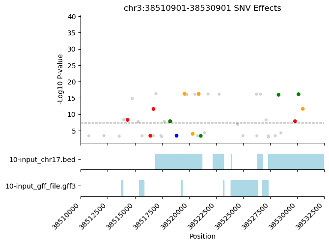

# tfsites.VisualizePhenotypicGenotypes v1

**Author(s):** Joe Solvason  

**Contact:** Joe Solvason (solvason@eng.ucsd.edu)

**Adapted as a GenePattern Module by:** Ted Liefeld (jliefeld@cloud.ucsd.edu)

**Task Type:** Transciption factor analysis

**LSID:**  urn:lsid:genepattern.org:module.analysis:00442


## Introduction

`visualizeGenotypeSnvEffects` graphs the effects of SNV mutations from a GWAS or eQTL dataset. The graph displays the p-value of each mutation along a genomic region of interest. The data points are colored according to the effect of the SNV. Possible mutation effects include increasing (optimizing) the affinity, decreasing (sub-optimizing) the affinity, deleting a binding site, or creating a binding site. Genomic regions of interest, such as intervals that contain exons, can be indicated on the plot. 


## Methodology

After running a GWAS experiment file through `analyzeGwas` or an eQTL file through `analyzeEqtl`, the input file for this tool is obtained. Each mutation in the file is plotted onto a scatterplot, where the x-axis is the genomic position and the y-axis is -log10 of the mutation's p-value. The user can zoom into a portion of the genome, if the chromosome and genomic range are provided.

Within the genomic region being plotted, if there are intervals from the input BED files that overlap, then they are highlighted. Similarly, if there is a GFF file provided, then the genomic regions where exons exist can also be highlighted. 


## Parameters

<span style="color: red;">*</span> indicates required parameter

### Inputs and Outputs 

- <span style="color: red;">*</span>**SNV Effects of GWAS/eQTL Data (.tsv)**
    - This file contains a list of mutations and their effect on TF binding sites. This is the output from `analyzeGwas` or `analyzeEqtl.` 
- **BED Genomic Interval Data (.bed)**
    - `Default = None`
    - This file contains a list of genomic intervals of interest. 
- **Genomic Feature Data (.gff3)**
    - `default = None`
    - This file contains genomic feature annotations, along with their position in the genome.
- <span style="color: red;">*</span>**Scatterplot of SNV Effects (.png)**
    - Run in beta mode if TRUE.
 
### Other Parameters

- **Zoom Window (dash-separated string)**
    - `Default = None`
    - Given a start position and an end position, zoom into a portion of the sequence. The numbers in the range are inclusive. For example, the first 200 nucleotides of the sequence would be specified as: `1-200`.
- **Beta Coefficient Present (boolean)**
    - `Default = False`
    - If `True`, include the beta coefficient in calculation of the y-axis (-log p-value * beta). If `False`, leave y-axis as -log(p-value). 


## Input Files

1.  SNV Effects of GWAS/eQTL Data (.tsv)
- Columns
    - `Chrom:` name of the chromosome
    - `Pos-1idx:` position of the SNV, 1-indexed
    - `Ref:` reference nucleotide
    - `Alt:` alternate nucleotide
    - `P_value:` statistical association between genotype and phenotype
    - `Overlap-[BED Genomic Interval Data #1]:` whether overlap exists between the mutations from the genotypic dataset and any genomic intervals contained in BED Genomic Interval Data #1 (1 if there is an overlap, 0 if there is no overlap)
    - `Overlap-[BED Genomic Interval Data #2]:` whether overlap exists between the mutations from the genotypic dataset and any genomic intervals contained in BED Genomic Interval Data #2 (1 if there is an overlap, 0 if there is no overlap)
    - `Ref_kmer:` reference binding site
    - `Alt_kmer:` alternate binding site
    - `Site_direction:` direction of the binding site (+ if it follows the given IUPAC or - if it follows the reverse complement of the IUPAC)
    - `Ref_aff:` the affinity of the reference binding site
    - `Alt_aff:` the affinity of the alternate binding site
    - `Fold_change:` the ratio between ref_aff and alt_aff
    - `Mut_type:` the type of SNV effect

```
chrom    pos      ref  alt  p_value   overlap-file1.bed  overlap-file2.bed  ref_kmer  alt_kmer   site_direction  ref_aff  alt_aff   fold_change   mut_type
chr1     1281643  G    C    1.53e-09  1                  0                  GGCAAGG   GGGAAGG    -               NaN      0.120     NaN           denovo
chr1     1307327  A    G    3.93e-09  0                  0                  TTGGAAAC  CTGGAAAC   -               0.097    0.118     1.216         inc
chr1     1309994  G    A    8.83e-11  0                  0                  GGGATTC   GAGGATTC   +               0.091    0.093     1.022         inc
chr1     1325256  A    C    5.08e-10  0                  1                  CGGTAACA  CGGGAACA   -               NaN      0.130     NaN           denovo
chr1     1337900  A    G    3.52e-12  0                  0                  GTGGAACT  GTGGAGCT   +               0.107    NaN       NaN           del
```
    
2. BED Genomic Interval Data (.bed)
- Columns:
    - `Chrom:` name of the chromosome
    - `Start:` starting position of the genomic interval
    - `End:` ending position of the genomic interval
 
```
chrom    start      end  
chr17    6806513    6806553
chr17    6808204    6808245
chr17    6811330    6811350
chr17    6815892    6815899
chr17    6819219    6819290
```


3. File containing genomic features and their coordinates (tab-separated with .gff extension)
- Columns
    - `0:` Name of chromosome
    - `1:` Data source of the feature
    - `2:` Feature type name
    - `3:` Start position of feature (1-indexed)
    - `4:` End position of feature (1-indexed)
    - `5:` Score
    - `6:` Strand direction
    - `7:` Frame
    - `8:` Additional information 

```
0         1       2                  3         4           5  6  7   8   
chr17     RefSeq  gene               6797760   6818159     .  +  .   ID=NC_000083.5:LOC100040603;Name=NC_000083.5:LOC100040603
chr17     RefSeq  mRNA               6797760   6818159     .  +  .   ID=XM_001475631.1;Parent=NC_000083.5:LOC100040603
chr17     RefSeq  protein            6806527   6812289     .  +  .   ID=;Parent=XM_001475631.1
chr17     RefSeq  five_prime_UTR     6797760   6797769     .  +  .   Parent=XM_001475631.1
chr17     RefSeq  five_prime_UTR     6806513   6806526     .  +  .   Parent=XM_001475631.1
```

       
## Output Files

  1.Scatterplot of SNV Effects (.png)
  
   
    
  
## Example Data

[Example input data is available on github](https://github.com/genepattern/tfsites.inSilicoSnvAnalysis/data)
    
    
## Version Comments

- **1.0.0** (2023-01-12): Initial draft of document scaffold.
- **1.0.1** (2024-02-02): Draft completed.
